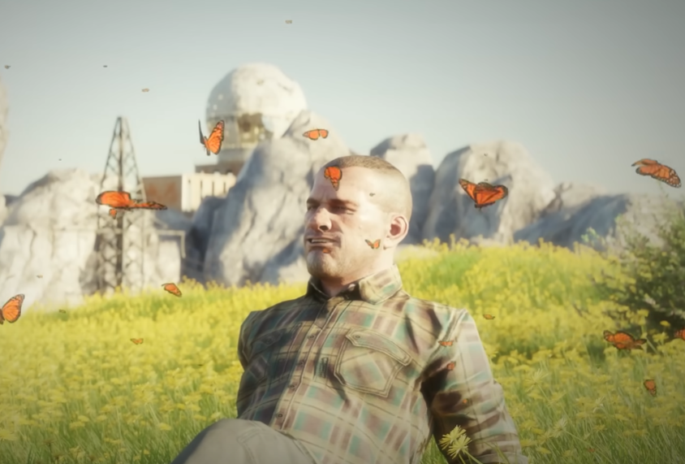

<div align="center">
 

</div>

<hr>


```javascript
const zina = {
  pronouns: "she" | "her", 
  who: "aspiring full-stack developer",
  code: [HTML5, CSS, Javascript, Node, PHP, SQL, C++, C#],
  tools: [Photoshop, Illustrator, In Design, XD, Premiere Pro, After Effects],
  languages: [French, English, German],
  personality: {
                aboutMe: "creative, team worker, productive, love new challenges", 
                hobbies: "videogames, web development"
             },
  
};
```

<hr>


<div align="center">

<h3><a href="https://zinabfs.fr/" style="color: deeppink">visit my personal website</a></h3>

</div>

<br>
<div align="center">


bisou :)
</div>
