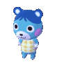

 

## hi i'm `zina`, i like javascript and videogames
 

 

 

<h3 align="center">
<a href="https://zinabfs.fr/">visit my personal website  

</a>
</h3>

<!--
**zinabfs/zinabfs** is a ✨ _special_ ✨ repository because its `README.md` (this file) appears on your GitHub profile.

Here are some ideas to get you started:

- 🔭 I’m currently working on ...
- 🌱 I’m currently learning ...
- 👯 I’m looking to collaborate on ...
- 🤔 I’m looking for help with ...
- 💬 Ask me about ...
- 📫 How to reach me: ...
- 😄 Pronouns: ...
- ⚡ Fun fact: ...
-->
